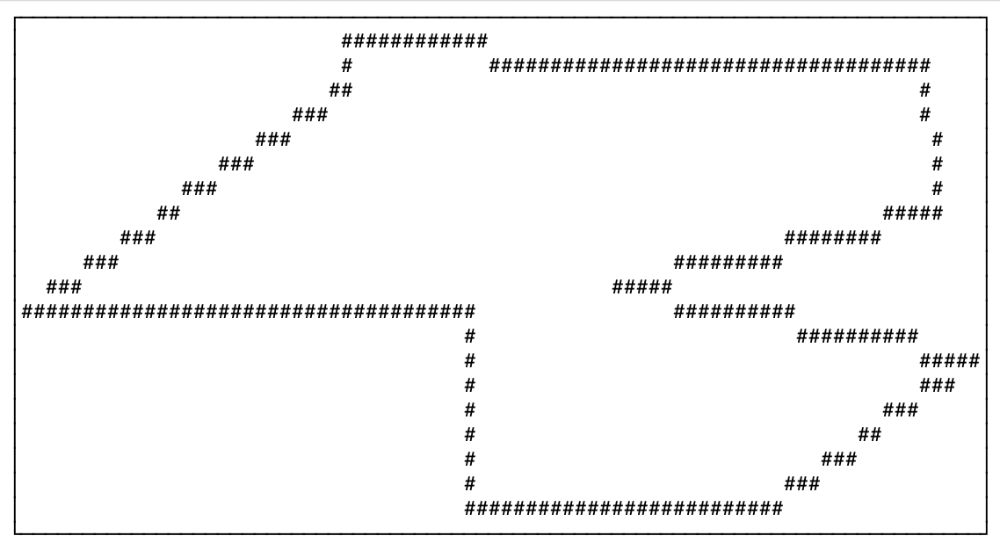
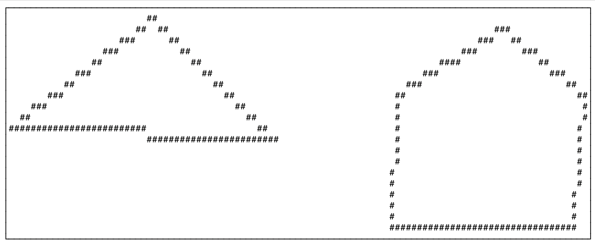

# GJSON CLI

Draw shapes of GeoJSON files directly in your terminal using purely ASCII characters.

> [!IMPORTANT]
> This is a work-in-progress.

> [!NOTE]  
> In order to be able to run this tool without errors, a properly formatted [GeoJSON](https://geojson.org/) file is expected.

To install dependencies:

```bash
bun install
```

To run:

```bash
bun render -p /path/to/my/geojson/file.geojson
```

Optional coloring:

```bash
bun render -p /path/to/my/geojson/file.geojson -c green
```

```bash
bun render -p /path/to/my/geojson/file.geojson -c #00FF00
```

This project was created using `bun init` in bun v1.2.16. [Bun](https://bun.sh) is a fast all-in-one JavaScript runtime.

## Examples

### Polygon

<details>
    <summary>GeoJSON Source</summary>

```json
{
  "type": "FeatureCollection",
  "features": [
    {
      "type": "Feature",
      "properties": {},
      "geometry": {
        "coordinates": [
          [
            [
              21.553846440766222,
              -3.5761219557684285
            ],
            [
              19.364563681482196,
              -5.600557585212471
            ],
            [
              22.402786978643263,
              -5.592681085114265
            ],
            [
              22.44247410755159,
              -7.381646533112374
            ],
            [
              24.449334747149777,
              -7.279393098686725
            ],
            [
              25.925007333045357,
              -6.026734807424532
            ],
            [
              23.434124979442572,
              -5.387358369478122
            ],
            [
              25.663377329188904,
              -4.541687126455926
            ],
            [
              25.5920881742598,
              -3.32278237653
            ],
            [
              23.632476340185207,
              -3.3069692400435713
            ],
            [
              21.545942591061817,
              -3.0138163816034336
            ],
            [
              21.553846440766222,
              -3.5761219557684285
            ]
          ]
        ],
        "type": "Polygon"
      }
    }
  ]
}
```

</details>

### MultiPolygon

<details>
    <summary>GeoJSON Source</summary>

```json
{
   "type":"FeatureCollection",
   "features":[
      {
         "type":"Feature",
         "properties":{},
         "geometry":{
            "type":"MultiPolygon",
            "coordinates":[
               [
                  [
                     [
                        138.76876258332965,
                        36.919172980201765
                     ],
                     [
                        138.25710231340952,
                        36.565094500742944
                     ],
                     [
                        139.19912164439575,
                        36.5323901149124
                     ],
                     [
                        138.76876258332965,
                        36.919172980201765
                     ]
                  ]
               ],
               [
                  [
                     [
                        140.01993796291652,
                        36.90081457620067
                     ],
                     [
                        139.63550174574743,
                        36.68645202801504
                     ],
                     [
                        139.6193800321294,
                        36.28404056311929
                     ],
                     [
                        140.2771738534592,
                        36.27466538686795
                     ],
                     [
                        140.31722944262208,
                        36.6678696854988
                     ],
                     [
                        140.01993796291652,
                        36.90081457620067
                     ]
                  ]
               ]
            ]
         }
      }
   ]
}
```

</details>